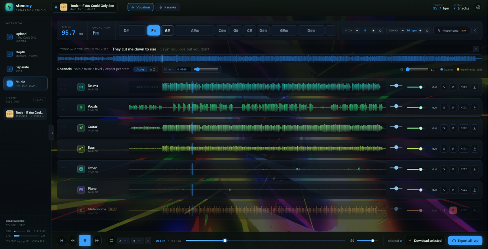
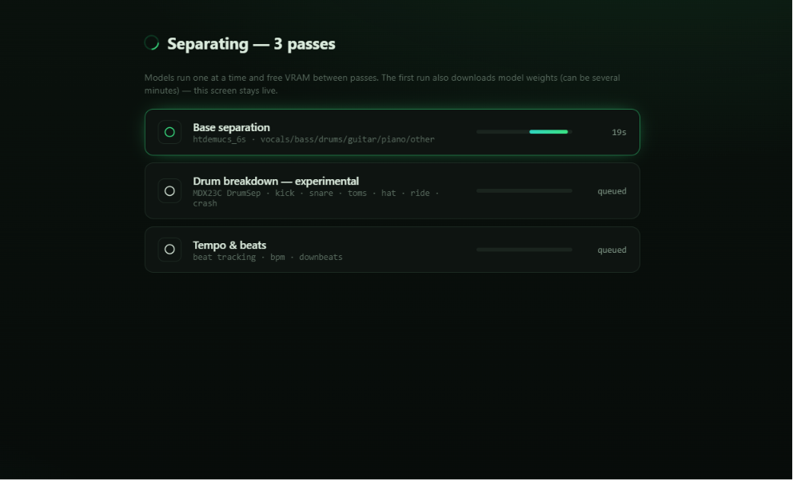
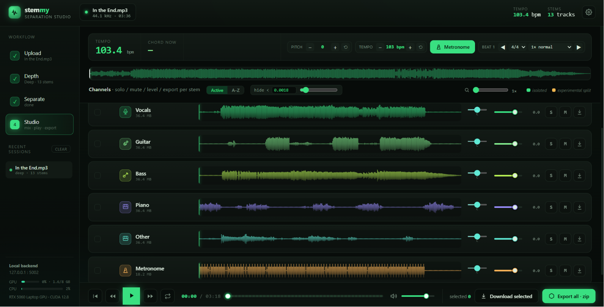
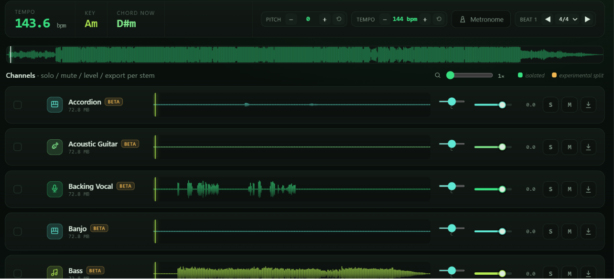

# Stemmy

A local, GPU-accelerated **stem-separation studio**. Drop in a song, pull it apart
into deep hierarchical stems — vocals, bass, **drums → kick / snare / toms / hi-hat /
ride / crash**, guitar, piano, keys, other — then solo, mute, level, pan, scrub against
a beat grid, shift pitch/tempo, watch live chord detection, and export stems as WAV or a
zip. Everything runs on your machine; **no audio ever leaves it**.



---

## Table of contents

- [What it does](#what-it-does)
- [Screenshots](#screenshots)
- [Tested on / requirements](#tested-on--requirements)
- [Disk space](#disk-space)
- [Quick start](#quick-start)
- [Separation depths](#separation-depths)
- [The studio](#the-studio)
- [Extended depth (53-stem, experimental)](#extended-depth-53-stem-experimental)
- [Honest limitations](#honest-limitations)
- [GPU / VRAM tuning (8 GB)](#gpu--vram-tuning-8-gb)
- [Project layout](#project-layout)
- [Launchers](#launchers)
- [License](#license)

---

## What it does

- **Local & private.** All separation and playback happen on your machine. No uploads, no cloud, no account.
- **Drop a file or paste a YouTube link.** Either upload audio (WAV/MP3/FLAC/M4A/OGG/AIFF) or paste a YouTube URL on the Upload screen — Stemmy fetches the audio locally with yt-dlp and runs the exact same separation flow.
- **A pipeline, not one model.** No single model separates everything well, so Stemmy chains specialised open-source models in sequential passes — the same approach the paid tools use internally. Each pass loads one model, runs, frees VRAM, then hands its output to the next. That keeps peak memory low enough for an 8 GB card.
- **Reliable drum split.** Deep separates the kit into kick / snare / toms / hi-hat / ride / crash, nested under Drums.
- **A real mixing studio.** Per-stem solo / mute / level / pan, real waveforms, a zoomable timeline, a beat-locked metronome with time-signature selector, offline pitch (±12) and tempo shift, live chord readout, colour themes, and per-stem or zip export.
- **Resume on interrupt.** Projects save to `projects/<id>/`; reopening a half-finished separation picks up from the last completed pass.

## Screenshots

**The separation passes stream in live** — each model runs one at a time and frees VRAM between passes:



**Mixing** — solo / mute / level / pan, real waveforms, metronome, pitch & tempo, live chord:



**Extended depth** (experimental) drives a 53-stem model for instrument-level splits:



## Tested on / requirements

Stemmy was built and run on this machine:

| | |
|---|---|
| OS | Windows 11 |
| GPU | NVIDIA GeForce RTX 5060 Laptop GPU (8 GB VRAM, Blackwell / sm_120) |
| System RAM | 16 GB |
| Python | 3.12 |
| PyTorch | 2.x + CUDA 12.8 (`cu128`) |

Requirements: an **NVIDIA GPU** (8 GB VRAM is enough for Quick / Standard / Deep), Python 3.10+,
and a CUDA-matched PyTorch. CPU-only will run but is very slow. The **Extended** depth is the
exception on RAM — see its section below.

## Disk space

Budget roughly **15–25 GB free**, mostly model weights downloaded on first use:

| Item | Approx size |
|------|-------------|
| `.venv` (torch + audio-separator + deps) | ~6–8 GB |
| Demucs models (`htdemucs_ft`, `htdemucs_6s`) | ~1–2 GB (auto-downloaded) |
| DrumSep model (Deep) | ~0.1 GB (auto-downloaded) |
| ZFTurbo MSST + 53-stem checkpoint (Extended, optional) | ~2–3 GB |
| Per-song output (stems are uncompressed WAV) | ~0.1–0.5 GB each |

## Quick start

> Prefer double-clicking? See **[BUILD.md](BUILD.md)** for the one-time `setup.bat` →
> `run.bat` flow and what every launcher does. The steps below are the manual equivalent.

PyTorch must match **your** CUDA, so install it first — otherwise `audio-separator` may pull
a CPU-only torch.

```bash
# 1) GPU torch for an RTX 5060 / CUDA 12.8 (Blackwell needs cu128)
pip install torch torchaudio --index-url https://download.pytorch.org/whl/cu128

# 2) everything else
pip install -r requirements.txt

# 3) confirm the GPU is visible
python -c "import torch; print(torch.cuda.is_available())"   # -> True

# 4) run it
python run_stemmy.py            # http://127.0.0.1:5002
python run_stemmy.py --port 5005
```

Upload a track **or paste a YouTube link** on the Upload screen, pick a depth, watch the passes stream in, then mix in the studio.

### YouTube links

The Upload screen has an "or paste a YouTube link" field. Stemmy downloads the audio with **yt-dlp** and extracts it to WAV with **ffmpeg**, then treats it like any uploaded file. Both `yt-dlp` and `imageio-ffmpeg` (a bundled ffmpeg, so you don't have to install one) are pulled in by `setup.bat` / `requirements.txt`; a system ffmpeg on your PATH is used if present. The fetched video's thumbnail is saved and shown next to the track in the Recent Sessions list. The fetch runs on your machine — only download tracks you have the rights to.

**If a link won't fetch:** re-run `setup.bat` (it updates yt-dlp), then try again. If it still fails, YouTube has likely changed something — update yt-dlp directly with `pip install -U yt-dlp`, or check [github.com/yt-dlp/yt-dlp](https://github.com/yt-dlp/yt-dlp) for the latest. The Upload screen shows this same hint when a fetch fails.

## Separation depths

The depth → pass → model mapping lives in `app/models.py` — tweak it freely. Quick / Standard /
Deep use models that **`audio-separator` downloads for you** the first time; nothing to fetch by hand.

| Depth | Stems | Models (passes) |
|-------|-------|-----------------|
| **Quick** | 4 | `htdemucs_ft` → vocals · drums · bass · other |
| **Standard** | 6 | `htdemucs_6s` → + guitar + piano |
| **Deep** | up to 13 | `htdemucs_6s` → **DrumSep** (kick/snare/toms/hi-hat/ride/crash) → keys split (if a model is configured) → analysis |
| **Extended** | many | ZFTurbo **MSST** 53-stem `bs_roformer` — *optional, experimental* (see below) |

**The drum split is built in.** Deep runs the base `htdemucs_6s` separation, then runs
`MDX23C-DrumSep-aufr33-jarredou.ckpt` (in audio-separator's catalog, auto-downloaded) on the
isolated `drums` stem. It's marked optional/experimental: if it can't load or runs out of VRAM,
the Deep run still completes with the base stems and the drum pass reports "skipped" — it can
never break a separation.

Run `check_models.bat` (or `audio-separator --list_models`) to see the full catalog and the exact
names you'd put in `app/models.py`.

## The studio

Once a separation finishes you land in the studio:

- **Per-stem controls** — solo, mute, level, pan; download a single stem or export all as a zip.
- **Real waveforms + zoomable timeline** (1×–100×), with a shared sample-locked playback clock.
- **Beat-locked metronome** generated from the detected beats, with a 3/4–7/8 time-signature selector.
- **Pitch & tempo** — offline, non-destructive pitch shift (±12 semitones) and tempo/BPM change.
- **Live chord readout** as the track plays, plus a tempo/beat-grid overview.
- **Channel sort** (Active / A–Z) and a **hide-below-peak slider** to tuck away empty stems.
- **Colour themes**, recent-session history (with a YouTube thumbnail per track), and a **collapsible side panel** (the handle on the panel's edge).

You can also open `app/templates/index.html` **directly** in a browser to iterate the UI on mock
data; served through Flask it renders the real project and plays the real stems.

## Extended depth (53-stem, experimental)

> **Status: works in theory, unverified on this hardware.** Extended is wired end-to-end and
> validated against stand-in tests, but it has **not** been confirmed to produce good separation
> on the author's 16 GB laptop — it runs the whole song through the model in one pass and **ran
> out of RAM before finishing**. Treat it as experimental.

audio-separator's catalog tops out at the 6 Demucs stems plus the drum split. To pull out **synth,
organ, strings, brass, winds, keys, percussion, kick, snare, toms, hi-hat** and dozens more, Stemmy
can optionally drive **ZFTurbo's MSST** (Music-Source-Separation-Training) with the community
**53-stem `bs_roformer`** model.

**Install it once** by running **`get_msst.bat`** (documented in [BUILD.md](BUILD.md)). With no git
it uses `curl` + PowerShell's `Expand-Archive` to fetch the MSST repo into `models_cache/msst/`,
installs the inference dependencies into your venv (restoring your cu128 torch if they disturb it),
downloads the model config + checkpoint (~2 GB) into `models_cache/msst_models/`, and writes a
`manifest.json`. Re-running only repairs what's broken. Once installed, the **Extended** card shows
"ready"; otherwise it says *"Needs MSST"* and the pass skips cleanly.

**It runs full-length, and that's the catch.** These big multi-stem models separate far better with
the whole song in view, so Stemmy runs Extended full-length (no chunking). The model assembles its
entire output as one large array, so a 4-minute song needs roughly **12–16 GB of free RAM** (more
for longer tracks):

- **16 GB total is not enough** with a browser / OneDrive open — it will OOM, and that's expected.
- **32 GB is comfortable; 64 GB for long tracks.**
- If Extended is skipped with an out-of-memory note, it **fails gracefully** — the rest of the run is
  unaffected. Close other apps and retry, use a shorter clip, or set `STEMMY_MSST_FULL=0` to fall
  back to chunked processing (bounded RAM, but the model smears sound into fewer stems).

**Two things it cannot do** (asked often enough to spell out):

- **You can't make it "only do guitars" to save resources.** The model emits all 53 stems in one
  pass — the cost is in producing the full array, not in keeping the results, so narrowing the output
  saves no RAM or time.
- **There is no rhythm / lead / clean guitar split.** Those are performance *roles*, not instruments;
  separation models work on sound sources. The most you get is `electric-guitar` / `acoustic-guitar` /
  `guitar` as instrument *types* (unreliably — a guitar can leak into `other` / `strings`).

**To swap models:** the model is chosen entirely by `get_msst.bat` (the `MODEL_TYPE`, `CFG_NAME`,
`CKPT_NAME`, `REL` variables at the top) and recorded in `manifest.json`. Pick a different
config+checkpoint from ZFTurbo's model list, update those four variables, and re-run — no code changes.

## Honest limitations

- **Guitar 1 vs guitar 2 / clean vs distorted** is the hardest case in source separation — same
  instrument, same timbre, often the same notes — and is essentially unsolved. Stemmy ships a guitar
  split as a best-effort `beta` pass and, with no split model configured, leaves a single clean guitar
  stem rather than inventing a bad one.
- **Keys split** (piano / synth / organ / strings) has no model in audio-separator's catalog, so that
  sub-split is skipped unless you wire one into the `keys` pass in `app/models.py`.
- **Extended** is experimental and RAM-bound as described above.

For dependable guitar + bass + vocals + multi-drum splits that fit in 16 GB, **use Deep**.

## GPU / VRAM tuning (8 GB)

Roformer-class models are memory-hungry. If you hit out-of-memory:

- Lower the model's `segment_size` (in the config audio-separator downloads).
- Keep passes sequential (the default) — don't load two big models at once.
- Stems are cached to disk between passes and reused, so a re-run is cheap.
- `fix_gpu.bat` applies a High Performance power plan + an EcoQoS opt-out so Windows doesn't throttle
  the GPU when the window loses focus on a laptop (see [BUILD.md](BUILD.md)).

## Project layout

```
app/
  server.py     Flask routes + SSE separation stream
  pipeline.py   pass orchestration (load model -> separate -> reorganise -> emit)
  models.py     depth presets + model registry + stem metadata
  msst.py       optional ZFTurbo MSST (Extended) orchestrator
  analysis.py   tempo / beat grid
  projects.py   project.json store + resume
  templates/index.html   the whole studio UI (self-contained; mock data when opened directly)
projects/       per-song output (gitignored)
uploads/        raw uploads (gitignored)
models_cache/   downloaded weights (gitignored)
```

## Launchers

The Windows `.bat` launchers (`setup`, `run`, `stop`, `check_gpu`, `check_models`, `fix_gpu`,
`get_msst`) are kept local and **gitignored**. Their full contents and what each does are documented
in **[BUILD.md](BUILD.md)** so anyone who clones the repo can recreate them.

This is a Flask **dev** server — fine for local single-user use. Put a real WSGI server in front if
you ever expose it.

## License

[MIT](LICENSE) — do what you like; no warranty. Bundled/optional models (Demucs, DrumSep, ZFTurbo
MSST) carry their own licenses from their respective projects.
