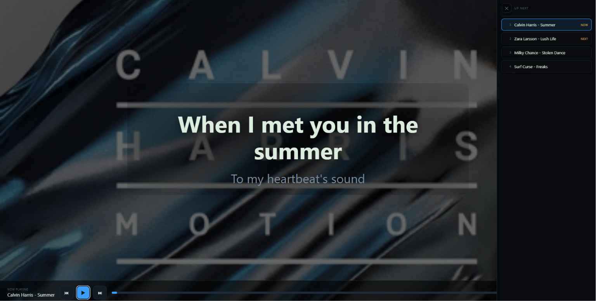

# Stemmy

A local, GPU-accelerated **stem-separation, remix, karaoke, and music-practice studio** for Windows.

Drop in an audio file or paste a YouTube link, split the song into stems, mix and export them, follow chords and lyrics, remove vocals from a playlist, tune an instrument, or generate chord progressions. Separation runs locally on your NVIDIA GPU; uploaded audio is not sent to a cloud service.


## Highlights

- **Multi-stage source separation:** vocals, bass, drums, guitar, piano, keys, other, plus a detailed drum split.
- **Full local studio:** solo, mute, level, pan, zoomable real waveforms, pitch/tempo adjustment, A-B looping, chord ribbon, and per-stem export.
- **Karaoke mode:** remove vocals from a single video or full YouTube playlist, save sessions, retry failures, and play the instrumentals in a full-screen queue.
- **Lyrics and song identification:** Shazam identification plus synced LRCLIB lyrics, with broader metadata matching and plain-text fallbacks.
- **MilkDrop visualizer:** Butterchurn/MilkDrop 2 presets in both Studio and Karaoke, with an independent album-cover backdrop.
- **Chromatic tuner:** stable local microphone/audio-interface tuner with Standard and alternate guitar tunings.
- **Chord Creator:** local, deterministic progression ideas across multiple genres; no AI service or API required.
- **Windows app-style launcher:** hidden background server, dedicated browser app window, desktop shortcut/icon, and close-window shutdown.
- **Safer maintenance:** background update checks with individual, opt-in updates for internet-facing helper packages. CUDA/model packages remain protected.

## Screenshots

**Separation passes**


**Studio mixer**


**Karaoke mode**



## Requirements

Stemmy has been developed and tested primarily on:

| Component | Tested configuration |
|---|---|
| OS | Windows 11 |
| GPU | NVIDIA GeForce RTX 5060 Laptop GPU, 8 GB VRAM |
| Python | 3.12 |
| PyTorch | CUDA 12.8 build |
| System RAM | 16 GB for Quick/Standard/Deep; more strongly recommended for Extended |

Use **Python 3.10 through 3.13**. Python 3.14 is currently too new for several packages in the audio stack.

An NVIDIA GPU is strongly recommended. CPU-only execution is possible but separation will be very slow.

Budget roughly **15–25 GB of free disk space** for the virtual environment, downloaded models, and uncompressed per-song stems.

## Quick start

### Current Windows package or cumulative overlay

The packaged Windows build includes the local launchers and app-style shortcut tools that are intentionally not all stored in Git.

1. Extract the package over the Stemmy folder and allow Windows to replace files.
2. On a first installation, run `install_all.bat` or `setup.bat`.
3. For later updates that only replace Stemmy source files, **do not run setup again**.
4. Start Stemmy with `run.bat`.
5. Run `Create Stemmy Shortcut.bat` once to create a desktop shortcut with the Stemmy icon.

Stemmy opens in a dedicated Edge or Chrome app window when available. Closing that window with **X** shuts down the local Python server as well. `stop.bat` remains an emergency fallback.

See [BUILD.md](BUILD.md) for the full Windows launcher workflow and troubleshooting.

### Raw Git clone

The simplest manual installation is:

```bat
py -3.12 -m venv .venv
call .venv\Scripts\activate.bat
python -m pip install --upgrade pip
pip install -r requirements.txt

rem RTX 50-series / CUDA 12.8 example:
pip install --force-reinstall --no-cache-dir torch torchaudio --index-url https://download.pytorch.org/whl/cu128

python -c "import torch; print(torch.cuda.is_available(), torch.cuda.get_device_name(0) if torch.cuda.is_available() else 'CPU')"
python run_stemmy.py
```

Use the PyTorch CUDA index appropriate for your GPU and driver. The CUDA build is installed **after** `requirements.txt` so another dependency cannot replace it with a CPU-only wheel.

Open `http://127.0.0.1:5002` if the browser does not open automatically.

## Separation depths

| Depth | Main result | Pipeline |
|---|---|---|
| **Quick** | 4 stems | vocals, drums, bass, other |
| **Standard** | 6 stems | Quick plus guitar and piano |
| **Deep** | up to 13 stems | Standard plus detailed drum separation and analysis |
| **Extended** | many instrument classes | Optional ZFTurbo MSST 53-stem model; experimental and RAM-heavy |

Models run sequentially and are unloaded between passes to reduce peak VRAM use.

Deep runs the isolated drum stem through a dedicated DrumSep model for kick, snare, toms, hi-hat, ride, and crash. An optional pass can fail or run out of memory without destroying the rest of a completed separation.

Extended prefers full-song inference when enough system RAM is available and can fall back to chunked inference. Expect substantially greater RAM use and longer processing times.

## Studio

The Studio includes:

- Per-stem solo, mute, level, pan, selection, and download controls.
- Sample-locked playback across decoded stems.
- Real waveforms with an overview and 1x–100x zoom.
- Pitch shifting and tempo adjustment.
- Detected-beat metronome with meter, feel, downbeat shift, and tap-tempo controls.
- Live chord readout and a scrolling chord ribbon.
- A-B loop markers on both the main transport and overview.
- Active/A-Z channel sorting and a hide-below-peak control.
- Green, blue, and red interface themes with theme-aware hover states.
- Export-selected and Export-all workflows. Supported browsers can show a Save As picker before writing the ZIP.
- Recent sessions and resumable unfinished projects.

The metronome's default source is the original **detected track beats**. A steady/tap-tempo mode remains available as a manual practice option.

## Tuner

The **Tuner** opens as a focused full-screen tool and defaults to **Standard** tuning.

Features include:

- Chromatic note detection with sharps/flats.
- Standard, half-step down, Drop D, D Standard, Drop C#, Drop C, Open G, and Open D presets.
- Selectable microphone or audio-interface input.
- Adjustable A4 reference.
- Confidence filtering, smoothing, and note-lock hysteresis to reduce unstable jumping.
- Automatic release of the input device when the tuner closes.

The tuner stops other Stemmy/Karaoke playback before listening so the app does not tune itself.

## Chord Creator

The **Chord Creator** generates local progression ideas without an LLM or external service.

Choose a starting chord, key feel, length, and one or more genres:

- Pop
- Classic rock
- Alternative rock
- Post-hardcore
- Metalcore
- Punk / pop-punk
- Indie
- Blues
- Folk / country
- Funk / R&B
- Jazz
- Cinematic / synthwave

Each result includes key context, Roman numerals, a strumming idea, preview playback, transposition, chord replacement, diagrams, copy/save controls, and easier guitar-shape/capo suggestions.

## Karaoke

Karaoke mode accepts a YouTube playlist or single video. For each track Stemmy:

1. Downloads the original audio.
2. Identifies the song from the original pre-separation audio when Shazam is available.
3. Fetches lyrics and artwork.
4. Runs a Quick vocal-removal separation.
5. Mixes the non-vocal stems into an instrumental.
6. Saves the result for playback and ZIP export.

Finished batches persist under `karaoke_jobs/`, survive a restart, and can be reopened later. Missing files are detected instead of being presented as playable. Failed tracks can be retried without reprocessing successful tracks.

The full-screen player includes synced lyrics, previous/next controls, auto-advance, a jumpable queue, MilkDrop presets, and an optional per-track album-cover background.

Only download media you have the right to use.

## Lyrics and song identification

When a Studio project or Karaoke track is loaded, the current Windows build attempts lyrics automatically:

1. Shazam identifies the original audio when `shazamio` is installed.
2. LRCLIB exact metadata lookup is attempted.
3. Broader and cleaned title/artist variants are tried when metadata differs.
4. Plain-text lyric fallbacks may be used when synced lyrics are unavailable.
5. Existing saved lyrics are not discarded because of a temporary provider miss.

Manual title and artist fields remain available when automatic identification or lookup cannot find a result.

Lyric diagnostics are written to:

```text
logs/stemmy-lyrics.log
```

Shazam and lyric providers require an internet connection. Audio separation itself remains local.

## Visualizer

The Studio and Karaoke player use locally bundled **Butterchurn**, a WebGL implementation of MilkDrop 2.

The visualizer and album-cover backdrop are independent:

- Visualizer only
- Cover only
- Both
- Neither

Preset and opacity preferences can be remembered, while both visual layers start disabled for a clean default view. A modern browser with WebGL2 is required.

## Windows launcher and background GPU behavior

The current Windows launcher does not depend on a focused PowerShell console:

- Python runs detached from the visible console.
- Stemmy Python processes are marked with high-priority/high-QoS settings.
- Output is redirected to files under `logs/`.
- The browser is opened as a dedicated Edge/Chrome app window when available.
- Closing the app window stops the server.
- Settings includes a separate **Close Stemmy** action.

This resolves the laptop behavior where GPU utilization dropped sharply when the console was minimized or lost focus.

Useful logs include:

```text
logs/stemmy.log
logs/stemmy-error.log
logs/stemmy-performance.log
logs/stemmy-lyrics.log
logs/stemmy-update.log
```

## Updates

Stemmy checks dependency status quietly in the background and shows the result under **Settings -> Updates**.

The interface allows individual, opt-in updates for frequently changing online helpers such as:

- `yt-dlp`
- `shazamio`
- `imageio-ffmpeg`

Individual updates are isolated with `--no-deps`, followed by a compatibility check. If the check fails, Stemmy attempts to restore the previous version.

Core numerical and GPU packages are **report-only/protected**, including PyTorch/CUDA, `audio-separator`, ONNX, and NumPy. These should be updated deliberately because an otherwise routine package upgrade can break model or CUDA compatibility.

## Optional MIDI and tab export

`get_tabs.bat` installs Basic Pitch and an ONNX runtime for per-stem audio-to-MIDI transcription.

MIDI is the dependable output. ASCII guitar/bass tab is a practice aid: it cannot represent all rhythm and polyphonic fingering information accurately. Drum stems can export MIDI but do not map to string tab.

## Data locations

```text
app/             application backend and UI
projects/        per-song source, stems, metadata, lyrics, and artwork
uploads/         temporary downloaded/uploaded audio
karaoke_jobs/    persisted Karaoke batch state
models_cache/    downloaded separation models
logs/            launcher, performance, update, and lyric diagnostics
```

The generated project, upload, model, job, and log data should remain outside version control.

## Honest limitations

- Separating two guitars into reliable rhythm/lead or clean/distorted roles remains a difficult unsolved source-separation problem.
- Key-family sub-splits depend on the available model and may be skipped.
- Chord recognition is a practical local estimate, not a professional transcription.
- Tuner accuracy depends on a clean input signal and the selected audio device.
- Karaoke downloads can occasionally fail when YouTube changes its delivery signatures; keep `yt-dlp` current.
- Lyrics depend on third-party identification and lyric metadata and cannot be guaranteed for every recording.
- Extended separation is experimental, slow, and RAM-heavy.

For dependable vocals, bass, guitar/piano, and detailed drums on an 8 GB GPU, use **Deep**.

## License

[MIT](LICENSE). Stemmy is provided without warranty. Bundled and optional models retain their own licenses.
